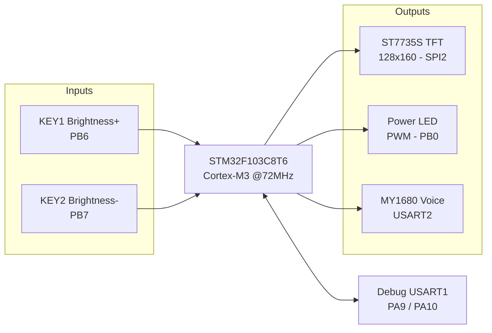
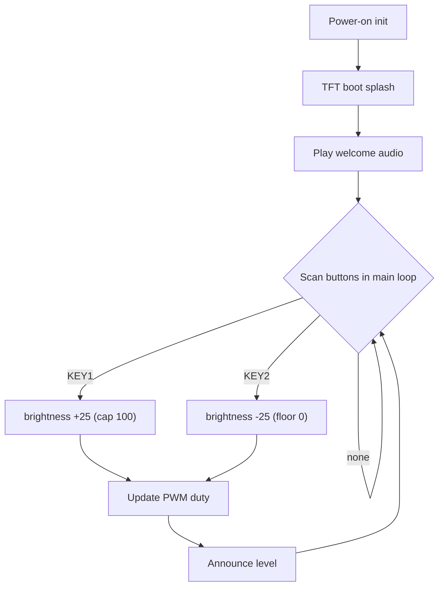

<div align="center">

# Smart Eye-Care Desk Lamp Firmware

**STM32F103C8T6 bare-metal firmware — PWM dimming, voice broadcast & 1.8″ TFT display**

[](https://www.st.com/en/microcontrollers-microprocessors/stm32f103c8t6.html)
[]()
[]()
[]()
[]()
[](LICENSE)

[简体中文](README.md) | **English**

</div>

---

## Overview

An eye-care desk lamp built around the **STM32F103RC** MCU. A hardware timer generates **PWM** to dim a power LED through an N-MOSFET; two push-buttons raise/lower the brightness. A **ST7735S TFT** shows a boot screen and status, while a **MY1680 voice module** announces the current brightness level after every adjustment, giving both visual and audio feedback. A USART command protocol is reserved for future Bluetooth/Wi-Fi remote control.

The firmware follows a **bare-metal super-loop + interrupt** architecture on top of the STM32 Standard Peripheral Library, with every peripheral wrapped in a cohesive, loosely-coupled BSP driver module.

## Features

- **Hardware PWM dimming** — TIM1_CH2 (PA9), 1 kHz flicker-free via an NPN low-side switch; five levels (0/25/50/75/100%) with software clamping
- **Button HMI** — brightness up/down keys (PB6/PB7) with 10 ms software debounce and release detection
- **TFT color display** — ST7735S (128×160, RGB565, hardware SPI2, 8P FPC); custom characters, Chinese glyphs and bitmaps, boot splash screen
- **Voice broadcast** — MY1680 over USART2 using a custom binary frame; plays per-level audio from a TF card, with BUSY polling to avoid dropped commands
- **SWD debugging** — ST-Link on PA13/PA14 for flashing & debugging; framed UART protocol reserved for wireless expansion
- **Accurate timing** — 1 ms SysTick tick for ms/µs delays
- **Extensible** — framed UART command protocol with checksums, ready for ambient-light sensing or wireless control

## System Architecture



## Hardware

<p align="center">
  
  <br>
  <sub>Wiring diagram drawn from the actual firmware pins (vector source: <code>docs/assets/wiring.svg</code>)</sub>
</p>

| Block | Device | Interface / Pins |
|---|---|---|
| MCU | STM32F103C8T6 (Cortex-M3, 64 KB Flash / 20 KB RAM) | — |
| Display | 1.8″ ST7735S TFT, 128×160, RGB565, 8P FPC | SPI2: SCK=PB13, SDA=PB15, CS=PB12, RS=PB10, RES=PB9, BLK=PB8 |
| Dimming | TIM1_CH2 PWM → NPN(SS8050) → 3 W warm-white LED | PA9, 1 kHz |
| Buttons | Up / Down tactile switches | PB6 / PB7 (10kΩ pull-up, active-low) |
| Voice | MY1680U-12P + TF card + speaker | USART2: PA2/PA3, BUSY=PA4, 9600 bps |
| Debug | ST-Link SWD | PA13 / PA14 |

> Full pinout, BOM, PWM timing and wiring notes: **[docs/hardware.md](docs/hardware.md)**.

## Software



Layered as **Standard Peripheral Library → BSP drivers → application**:

```
firmware/user/api/
├── pwm.c/h     # TIM3 PWM dimming
├── key.c/h     # button scan + debounce
├── lcd.c/h     # ST7735S driver (graphics/text/Chinese/bitmap)
├── MY1680.c/h  # voice module protocol & playback
├── usart.c/h   # debug UART & command RX
├── spi.c/h     # SPI2 low-level
├── led.c/h     # status LEDs
└── delay.c/h   # SysTick delays
```

> Module details, protocol frames and flowcharts: **[docs/firmware.md](docs/firmware.md)**.

## Getting Started

**Requirements**: Keil MDK-ARM (ARM Compiler 5), ST-Link V2, an STM32F103RC board.

```bash
git clone https://github.com/musuixin01/stm32-smart-eye-care-lamp.git
cd stm32-smart-eye-care-lamp
# Open firmware/project/stm32f1.uvprojx in Keil
# (Optional) set your name/ID macros at the top of firmware/user/main.c
# Press F7 to build, F8 to flash via ST-Link SWD
```

After flashing, the TFT shows a welcome screen and plays a greeting. KEY1 steps brightness up and KEY2 steps it down to off; every change is announced, and USART1 (115200-8-N-1) prints runtime logs.

## Highlights

- Timer-based **1 kHz hardware PWM dimming** — duty cycle control with no visible flicker
- Hand-written **ST7735S SPI TFT driver**: init sequence, GRAM windowing, primitives, ASCII/Chinese fonts and RGB565 bitmaps
- **Custom UART binary protocol** (header / length / command / XOR checksum / tail) and **ring-buffer + IDLE-interrupt** reception
- Coordinated use of TIM, dual USART, SPI, GPIO and SysTick, in a **modular, portable, layered** design
- Production-ready repository: `.gitignore`, MIT license, hardware/firmware docs, ready-to-build Keil project

## Roadmap

- [ ] Five-level stepping → continuous dimming (ADC knob / capacitive slider)
- [ ] BH1750 ambient-light sensor for automatic brightness
- [ ] Bluetooth/Wi-Fi via the reserved USART protocol + mobile app
- [ ] Refactor the super-loop into a non-blocking state machine; add eye-care timers and sunrise wake-up
- [ ] Resolve the PB11 mux (TFT_DC vs. voice BUSY) by assigning BUSY a dedicated GPIO

## Repository Layout

```
stm32-smart-eye-care-lamp/
├── firmware/                 # Keil MDK firmware
│   ├── project/              # .uvprojx & RTE config
│   ├── startup/              # high-density startup file
│   ├── user/                 # application & custom BSP drivers
│   └── STM32F10x_StdPeriph_Driver/   # ST Standard Peripheral Library
├── docs/
│   ├── assets/               # wiring diagram (PNG / SVG source)
│   ├── hardware.md           # pinout / BOM / dimming theory
│   └── firmware.md           # architecture / modules / protocols
├── LICENSE
└── README.md
```

## License

[MIT License](LICENSE). The STM32F10x Standard Peripheral Library under `firmware/STM32F10x_StdPeriph_Driver/` is © STMicroelectronics and redistributed under its original terms.

<div align="center">

⭐ Star this repo if it helped you

</div>
