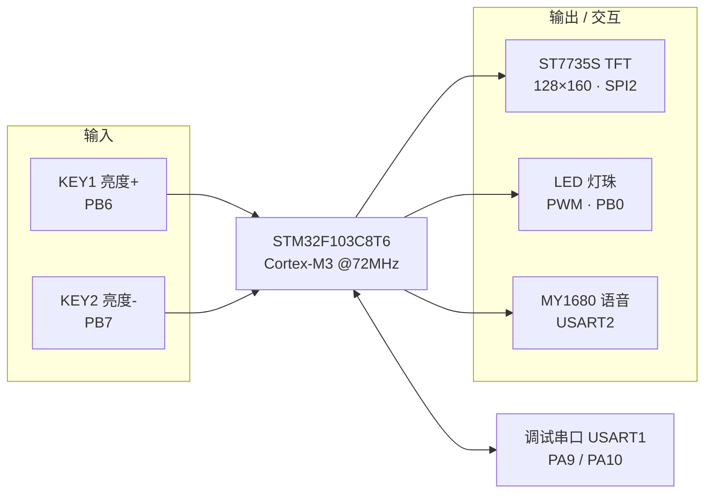
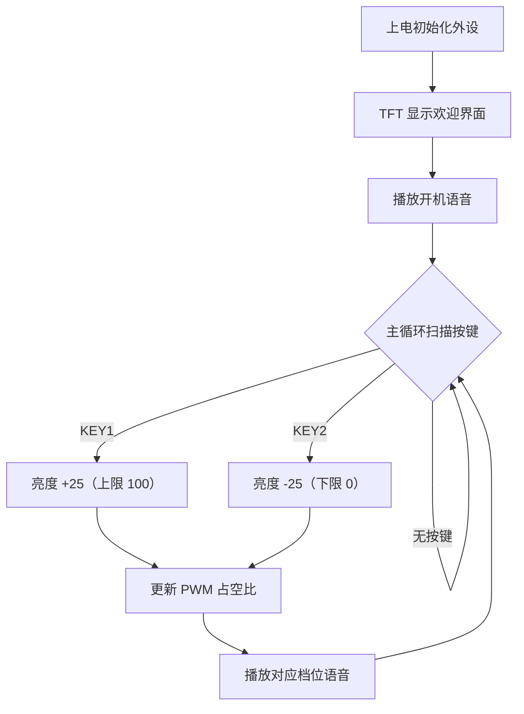

<div align="center">

# 智能护眼台灯固件 · Smart Eye-Care Desk Lamp

**基于 STM32F103C8T6 的 PWM 调光、语音播报与 1.8″ TFT 彩屏显示的嵌入式裸机项目**

[](https://www.st.com/en/microcontrollers-microprocessors/stm32f103c8t6.html)
[]()
[]()
[]()
[]()
[](LICENSE)

</div>

---

## 项目简介

一款以 **STM32F103RC** 为主控的智能护眼台灯。使用 **定时器硬件 PWM** 控制 LED 灯珠占空比实现调光，通过两个按键进行亮度加 / 减操作；搭载 **ST7735S TFT 彩屏**显示开机界面与状态信息，并通过 **MY1680 语音模块**在每次调光时同步语音播报当前亮度，形成「屏幕 + 语音」双重交互反馈。同时预留 USART 串口指令协议，便于后续扩展蓝牙 / Wi-Fi 远程控制。

项目采用**裸机超级循环 + 中断**架构，基于 STM32 标准外设库，将各外设封装为高内聚、低耦合的 BSP 驱动模块。

## 功能特性

- **硬件 PWM 调光**：TIM1_CH2（PA9）输出 1 kHz PWM，经 NPN 三极管低边驱动，无频闪；0% / 25% / 50% / 75% / 100% 五档亮度，软件限幅保护
- **按键交互**：亮度加 / 减两键（PB6/PB7），10 ms 软件消抖 + 等待释放，防止误触发与连按
- **TFT 彩屏显示**：ST7735S（128×160，RGB565，硬件 SPI2，8P FPC），自绘字符 / 汉字 / 位图，含开机欢迎界面
- **语音播报**：MY1680 模块经 USART2 发送自定义二进制协议帧，按档位播放 TF 卡语音，BUSY 忙等待防丢帧
- **SWD 烧录调试**：ST-Link 经 PA13/PA14 SWD 烧录与在线调试；串口指令协议帧保留，便于后续扩展蓝牙 / Wi-Fi
- **精确时基**：SysTick 1 ms 中断提供毫秒 / 微秒延时
- **可扩展接口**：串口指令帧 + 校验机制，为环境光自适应、无线远程控制预留

## 系统架构



## 硬件方案

<p align="center">
  
  <br>
  <sub>硬件接线示意图（依据固件实际引脚绘制，矢量源文件见 <code>docs/assets/wiring.svg</code>）</sub>
</p>

| 模块 | 器件 | 接口 / 引脚 |
|---|---|---|
| 主控 | STM32F103C8T6（Cortex-M3，64 KB Flash / 20 KB RAM） | — |
| 显示 | 1.8″ ST7735S TFT，128×160，RGB565，8P FPC | SPI2：SCK=PB13，SDA=PB15，CS=PB12，RS=PB10，RES=PB9，BLK=PB8 |
| 调光 | TIM1_CH2 PWM → NPN（SS8050）→ 3 W 暖白 LED | PA9，1 kHz |
| 按键 | 亮度+ / 亮度− 轻触开关 | PB6 / PB7（外 10kΩ 上拉，低有效） |
| 语音 | MY1680U-12P + TF 卡 + 喇叭 | USART2：PA2/PA3，BUSY=PA4，9600 bps |
| 烧录 | ST-Link SWD | PA13 / PA14 |

> 完整引脚映射、BOM、PWM 时序与接线说明见 **[docs/hardware.md](docs/hardware.md)**。

## 软件设计



代码按「标准库 → BSP 驱动 → 应用层」分层组织：

```
firmware/user/api/
├── pwm.c/h     # TIM3 PWM 调光
├── key.c/h     # 按键扫描 + 消抖
├── lcd.c/h     # ST7735S TFT 驱动（图形/字符/中文/位图）
├── MY1680.c/h  # 语音模块协议与播放
├── usart.c/h   # 调试串口 + 指令收发
├── spi.c/h     # SPI2 底层
├── led.c/h     # 状态指示灯
└── delay.c/h   # SysTick 延时
```

> 模块详解、协议帧格式、流程图见 **[docs/firmware.md](docs/firmware.md)**。

## 快速开始

**环境要求**：Keil MDK-ARM（ARM Compiler 5）、ST-Link V2、STM32F103C8T6 自制板/核心板

```bash
# 1. 克隆仓库
git clone https://github.com/musuixin01/stm32-smart-eye-care-lamp.git
cd stm32-smart-eye-care-lamp

# 2. 用 Keil 打开工程
#    firmware/project/stm32f1.uvprojx
# 3.（可选）在 firmware/user/main.c 顶部填入自己的姓名/学号宏
# 4. F7 编译，F8 通过 ST-Link SWD 烧录
```

烧录后：屏幕显示开机欢迎界面并播放欢迎语音；按 KEY1 亮度逐级增加、KEY2 逐级减小直至关灯，每次切换均有语音播报；串口（115200-8-N-1）输出运行日志。

## 技术亮点

- 基于定时器的 **1 kHz 硬件 PWM 调光**，理解占空比与视觉暂留，做到无频闪
- 手写 **ST7735S SPI TFT 驱动**：初始化序列、显存窗口、画点/线/矩形/圆、ASCII/汉字字库与 RGB565 位图
- 实现 **UART 自定义二进制协议**（帧头 / 长度 / 命令 / 异或校验 / 帧尾）与**串口环形缓冲 + IDLE 中断**接收
- 多外设协同（TIM、USART×2、SPI、GPIO、SysTick）与**模块化分层**设计，驱动可复用、可移植
- 完整的工程化交付：`.gitignore`、MIT 协议、硬件/软件文档、可直接编译的 Keil 工程

## 后续改进

- [ ] 五档步进 → 无级连续调光（ADC 旋钮 / 电容滑条）
- [ ] 接入 BH1750 环境光传感器，实现自适应亮度
- [ ] 利用预留的 USART 协议接入蓝牙 / Wi-Fi，实现手机 App 控制
- [ ] 超级循环重构为非阻塞状态机 / 时间片调度，加入定时护眼提醒、日出渐亮唤醒
- [ ] 修正 PB11（TFT_DC 与语音 BUSY）引脚复用，给 BUSY 分配独立 GPIO

## 目录结构

```
stm32-smart-eye-care-lamp/
├── firmware/                 # 固件工程（Keil MDK）
│   ├── project/              # .uvprojx 工程与 RTE 配置
│   ├── startup/              # 启动文件（HD 高密度）
│   ├── user/                 # 应用主程序与自研 BSP 驱动
│   └── STM32F10x_StdPeriph_Driver/   # ST 标准外设库
├── docs/
│   ├── assets/               # 接线示意图（PNG / SVG 源文件）
│   ├── hardware.md           # 硬件设计：引脚映射 / BOM / 调光原理
│   └── firmware.md           # 软件设计：架构 / 模块 / 通信协议
├── LICENSE
└── README.md
```

## 许可证

[MIT License](LICENSE)。`firmware/STM32F10x_StdPeriph_Driver/` 下的标准外设库版权归 STMicroelectronics 所有，遵循其原始许可。

<div align="center">

⭐ 如果这个项目对你有帮助，欢迎 Star

</div>
