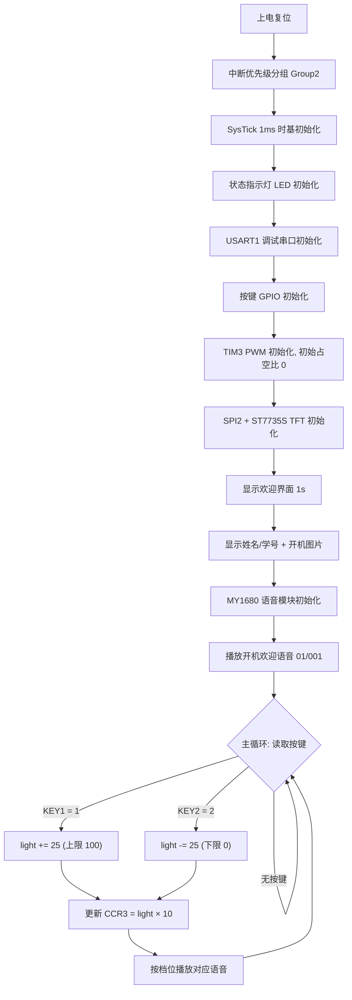

# 软件设计说明（Firmware）

裸机（无 RTOS）固件，基于 STM32 标准外设库开发，采用**分层 + 模块化**组织：底层 BSP 驱动与上层应用逻辑解耦，各外设封装为独立的 `.c/.h` 模块，主程序只负责业务状态机。

- 开发环境：Keil MDK-ARM（ARM Compiler 5）
- 固件库：STM32F10x StdPeriph_Driver V3.5.0
- 调度方式：`main` 超级循环（super-loop）+ 中断（SysTick、USART1）
- 时间基准：SysTick 配置为 1 ms 中断

---

## 1. 软件流程图



---

## 2. 目录与模块说明

```
firmware/
├── project/
│   ├── stm32f1.uvprojx        # Keil 工程文件（双击打开）
│   ├── RTE/                   # Keil Run-Time Environment 配置
│   └── DebugConfig/           # 调试器配置
├── startup/
│   └── startup_stm32f10x_hd.s # 高密度（HD）启动文件
├── user/
│   ├── main.c                 # 应用主程序：初始化 + 亮度状态机
│   ├── stm32f10x_it.c         # 中断服务程序（Cortex-M3 异常）
│   ├── stm32f10x_conf.h       # 标准库外设配置（包含哪些外设头）
│   ├── system_stm32f10x.c     # 时钟树配置（HSE 8M → PLL 72M）
│   └── api/                   # 自研板级驱动（BSP）
│       ├── delay.c/.h         # SysTick 1ms 精确延时
│       ├── key.c/.h           # 按键扫描 + 软件消抖
│       ├── led.c/.h           # 状态指示灯驱动
│       ├── pwm.c/.h           # TIM3_CH3 PWM 调光
│       ├── usart.c/.h         # USART1 调试串口 / 指令收发
│       ├── spi.c/.h           # SPI2 底层收发
│       ├── lcd.c/.h           # ST7735S TFT 驱动（图形/字符/中文/位图）
│       ├── lcdfont.h          # ASCII 与中文字库
│       ├── MY1680.c/.h        # MY1680 语音模块驱动与协议
│       └── p1.h               # 开机界面 128×128 位图（RGB565）
└── STM32F10x_StdPeriph_Driver/  # ST 官方标准外设库（inc / src）
```

| 模块 | 关键函数 | 作用 |
|---|---|---|
| `main` | `main()` | 初始化各外设，循环扫描按键并执行亮度状态机 |
| `delay` | `Delay_ms()` / `Delay_us()` / `SysTick_Handler()` | 基于 SysTick 的毫秒/微秒延时，提供系统滴答 |
| `key` | `Key_Init()` / `Key_GetValue()` | 两个按键的 GPIO 初始化与扫描（含消抖） |
| `pwm` | `Pwm_Config()` / `Pwm_LedSetLight()` | TIM3 PWM 输出，按 0~100 设置占空比（内部限幅） |
| `led` | `Led_Init()` / `Led_On()` / `Led_Off()` | 三路状态指示灯 |
| `usart` | `USART1_Config()` / `fputc()` | 115200 串口、`printf` 重定向、中断接收 |
| `spi` | `SPI2_Config()` / `SPI2_SendRecvByte()` | SPI2 主机模式底层字节收发 |
| `lcd` | `LCD_Init()` / `LCD_ShowString()` / `LCD_ShowChinese()` / `LCD_ShowPicture()` | ST7735S 初始化、画点/线/矩形/圆、字符、汉字、位图 |
| `MY1680` | `MY1680_Init()` / `Voice_SendCmd()` / `Voice_PlayDirectoryMusic()` | 语音模块初始化、协议组帧与校验、按目录播放 |

---

## 3. 关键实现要点

### 3.1 按键软件消抖

`Key_GetValue()` 采用「检测电平 → 延时 10 ms 复核 → 等待释放」的方式，避免机械抖动造成的多次触发，无需额外硬件：

```c
if (GPIO_ReadInputDataBit(GPIOA, GPIO_Pin_0) == Bit_SET) {
    Delay_ms(10);                                   // 消抖
    if (GPIO_ReadInputDataBit(GPIOA, GPIO_Pin_0) == Bit_SET) {
        while (GPIO_ReadInputDataBit(GPIOA, GPIO_Pin_0) == Bit_SET) {} // 等释放
        return 1;                                   // KEY1：亮度加
    }
}
```

### 3.2 PWM 调光

TIM3_CH3 输出 1 kHz PWM，应用层只传入 0~100 的亮度百分比，驱动内部换算为比较值并限幅：

```c
#define CLAMP(x, min, max) ((x) < (min) ? (min) : ((x) > (max) ? (max) : (x)))

void Pwm_LedSetLight(int light) {
    uint16_t l = CLAMP(light, 0, 100);
    TIM_SetCompare3(TIM3, l * 10);     // 0~100 映射到 CCR 0~1000
}
```

### 3.3 串口接收（中断 + 环形缓冲 + IDLE）

USART1 同时使能 `RXNE`（字节到达）与 `IDLE`（总线空闲）中断：每收到一个字节写入环形缓冲区，一帧结束（总线空闲）时置位接收完成标志，主循环再按协议解析，避免在中断中做耗时处理。`fputc()` 重定向后可直接使用 `printf` 输出调试日志。

---

## 4. 通信协议

### 4.1 MY1680 语音模块串口协议（USART2，9600-8-N-1）

控制帧格式：

| 帧头 | 数据长度 | 命令字 | 参数（1~n 字节） | 异或校验 | 帧尾 |
|:---:|:---:|:---:|:---:|:---:|:---:|
| `0x7E` | `Len` | `Cmd` | `Data...` | `XOR` | `0xEF` |

- 校验 = 从「数据长度」开始到「最后一个参数」逐字节异或
- 常用命令：播放 `0x11`、停止 `0x12`、按目录选曲 `0x42`、根目录选曲 `0x41`
- 播放「01 文件夹下第 002 首」示例：

  ```
  7E 04 42 01 02 41 EF
   │  │  │  │  │  └─ 帧尾
   │  │  │  │  └──── 异或校验
   │  │  │  └─────── 参数：目录号=01，曲目号=02
   │  │  └────────── 命令 0x42（按目录选曲）
   │  └───────────── 数据长度
   └──────────────── 帧头
  ```

- 发送播放指令前通过 BUSY 引脚等待模块空闲，防止指令丢失。

### 4.2 USART1 上位机指令协议（预留扩展，115200-8-N-1）

固件中预留了一个 6 字节自定义帧的解析框架（见 `USART1_ReavBuffAnalysis()`）：

| 字节 | 含义 |
|---|---|
| `buff[0..1]` | 帧头 |
| `buff[2]` | 设备 / 地址 ID |
| `buff[3]` | 命令类型（1=灯光控制，2=物品数量等） |
| `buff[4]` | 参数（如开/关、档位） |
| `buff[5]` | 校验 = `buff[2] + buff[3] + buff[4]`（和校验） |

该接口为后续接入蓝牙 / Wi-Fi / 上位机进行远程调光预留。

---

## 5. 编译与烧录

1. 使用 Keil MDK-ARM 打开 `firmware/project/stm32f1.uvprojx`；
2. 确认目标芯片为 **STM32F103RC**、编译宏 `STM32F10X_HD,USE_STDPERIPH_DRIVER`；
3. `F7`（Build）编译，`F8`（Download）通过 ST-Link SWD 烧录；
4. 串口接 `PA9/PA10`（115200-8-N-1）可查看 `printf` 日志。

> 首次编译时 Keil 会自动生成 `Objects/`、`Listings/` 目录，这些产物已被 `.gitignore` 忽略，不进入版本库。
