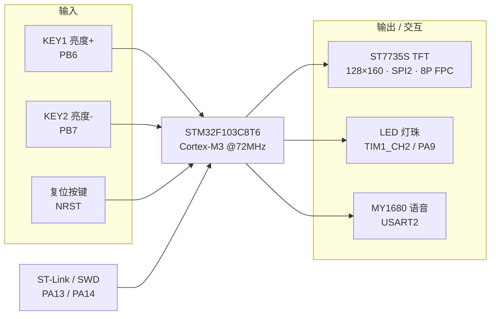
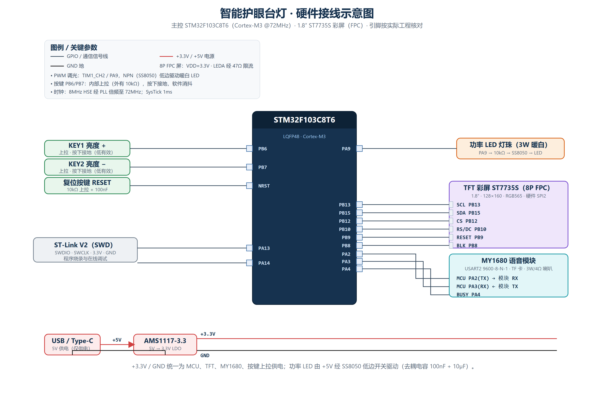

# 硬件设计说明（Hardware）

> 本文档所有引脚分配、定时器通道、通信参数均**依据最终工程原理图逐脚核对**，与立创EDA 工程保持一致。
>
> 正式原理图见 [`assets/schematic.png`](assets/schematic.png)（嘉立创EDA 导出）。

- **主控 MCU**：STM32F103**C8T6**（ARM Cortex-M3，72 MHz，**64 KB Flash / 20 KB SRAM**，LQFP48）
- **固件库**：STM32F10x Standard Peripheral Library V3.5.0（编译宏 `STM32F10X_MD, USE_STDPERIPH_DRIVER`，启动文件 `startup_stm32f10x_md.s`）
- **显示**：1.8″ TFT 彩屏，驱动 IC **ST7735S**，128×160，RGB565，硬件 **SPI2**，经 **8P FPC** 座连接
- **语音**：MY1680U-12P MP3 语音模块（UART 指令 + TF 卡音频）
- **调光**：TIM1_CH2 经 NPN 三极管（SS8050）低边驱动大功率 LED 灯珠

---

## 1. 系统框图

---

## 2. 完整接线示意图

下图按最终工程引脚绘制（含电源轨）。矢量源文件为 [`assets/wiring.svg`](assets/wiring.svg)，可自由放大或二次编辑：

  

---

## 3. 引脚映射表（Pinout）

| 功能 | STM32 引脚 | 外设 / 模式 | 电平 / 参数 | 备注 |
|---|---|---|---|---|
| **PWM 调光输出** | `PA9` | TIM1_CH2，复用推挽 | 1 kHz，NPN 低边驱动 | 经 10kΩ → SS8050 基极 |
| TFT SPI2_SCK | `PB13` | 复用推挽 | SPI2 主机，MSB | |
| TFT SPI2_MOSI | `PB15` | 复用推挽 | 数据线 SDA | |
| TFT 片选 CS | `PB12` | 推挽输出 | 低有效 | |
| TFT 数据/命令 RS(DC) | `PB10` | 推挽输出 | 低=命令 / 高=数据 | |
| TFT 复位 RES | `PB9` | 推挽输出 | 低复位（10kΩ 上拉） | |
| TFT 背光 BLK | `PB8` | 推挽输出 | 高点亮（LEDA 经 47Ω） | |
| **KEY1 亮度加** | `PB6` | 上拉输入 | 按下为**低电平**（外 10kΩ 上拉） | |
| **KEY2 亮度减** | `PB7` | 上拉输入 | 按下为**低电平**（外 10kΩ 上拉） | |
| 语音 USART2_TX → MY1680_RX | `PA2` | 复用推挽 | 9600-8-N-1 | |
| 语音 USART2_RX ← MY1680_TX | `PA3` | 上拉输入 | 9600-8-N-1 | |
| 语音 BUSY 检测 | `PA4` | 上拉输入 | 播放中为高电平 | 独立引脚，无复用冲突 |
| 复位按键 | `NRST` | — | 10kΩ 上拉 + 100nF | |
| SWD 烧录调试 | `PA13 / PA14` | SWDIO / SWCLK | ST-Link | |
| 系统时钟 | OSC_IN / OSC_OUT | 8 MHz HSE + PLL | 倍频至 72 MHz | |

> 说明：本板 USB Type-C 仅用于供电（无 USB 转串口芯片），`PA9` 复用作 PWM，故未引出 USART1；程序烧录与调试走 SWD。按键 PB6/PB7 为普通 GPIO，**不需要禁用 JTAG**。

---

## 4. PWM 调光原理

- 定时器：`TIM1`，通道 `CH2` → 引脚 `PA9`
- 定时器时钟：72 MHz
- 预分频 `PSC = 72 - 1`，自动重装载 `ARR = 1000 - 1`
- PWM 频率：`f = 72 MHz / 72 / 1000 = 1 kHz`，远高于人眼可感知频率，无频闪。
- 比较寄存器 `CCR2` 取值 0 ~ 1000，对应占空比 0% ~ 100%。

| 亮度档位 light | CCR2 | 占空比 | 语音文件（TF 卡） |
|:---:|:---:|:---:|:---|
| 0（关灯） | 0 | 0% | `01/006.mp3` |
| 25 | 250 | 25% | `01/002.mp3` |
| 50 | 500 | 50% | `01/003.mp3` |
| 75 | 750 | 75% | `01/004.mp3` |
| 100（最亮） | 1000 | 100% | `01/005.mp3` |
| 开机欢迎 | — | — | `01/001.mp3` |

- PA9 输出的 PWM 经 10kΩ 基极电阻驱动 **NPN 三极管 SS8050**（低边开关）：LED 灯珠接在 3.3V/5V 电源与集电极之间，基极高电平时三极管导通、LED 点亮，通过占空比调节平均电流从而调光。

---

## 5. 物料清单（BOM，参考）

| # | 名称 | 型号 / 规格 | 数量 | 说明 |
|---|---|---|:---:|---|
| 1 | 主控 | STM32F103C8T6 | 1 | Cortex-M3，72 MHz，LQFP48 |
| 2 | TFT 彩屏 | 1.8″ ST7735S，128×160，SPI | 1 | 8P FPC 排线 |
| 3 | FPC 连接器 | 0.5mm / 8P 翻盖 | 1 | 屏排线座 |
| 4 | 语音模块 | MY1680U-12P | 1 | UART 控制，TF 卡播放 |
| 5 | TF 卡 | MicroSD（≤ 32 GB，FAT32） | 1 | 存放 `01/001~006.mp3` |
| 6 | 喇叭 | 3 W / 4 Ω | 1 | 语音播报 |
| 7 | 功率 LED | 暖白 3 W 灯珠 | 1 | 主照明 |
| 8 | 开关管 | SS8050（NPN） | 1 | PWM 低边驱动 LED |
| 9 | 轻触按键 | TS-1187A 类 | 2 | 亮度 + / 亮度 − |
| 10 | 稳压 | AMS1117-3.3 | 1 | 5 V → 3.3 V |
| 11 | 电阻 / 电容 | 10kΩ、10kΩ(LED 限流)、100nF、10µF、47Ω 等 | 若干 | 上拉 / 限流 / 去耦 |
| 12 | 下载调试 | ST-Link V2（SWD） | 1 | 烧录与调试 |
| 13 | 供电 | USB Type-C 5 V | 1 | 仅供电 |

---

## 6. 已知问题与改进建议

- **Flash 容量（64 KB）**：C8T6 仅 64 KB Flash，ST7735S 驱动 + 中文字库 + 语音协议需精简中文字模（仅保留开机必要汉字）；如需更大字库可改用引脚兼容的 **STM32F103CBT6（128 KB）**。
- **无级调光**：当前为 0/25/50/75/100 五档，后续可改 ADC 旋钮 / 电容滑条无级调光。
- **环境光自适应**：可在空闲 PB6/PB7 之外另引 I²C（PB6/PB7 硬件 I2C1）接 BH1750 实现自适应亮度。
- **无线控制**：PA2/PA3 的 USART2 现占用，可另引空闲脚接蓝牙 / Wi-Fi 模块远程控制。
