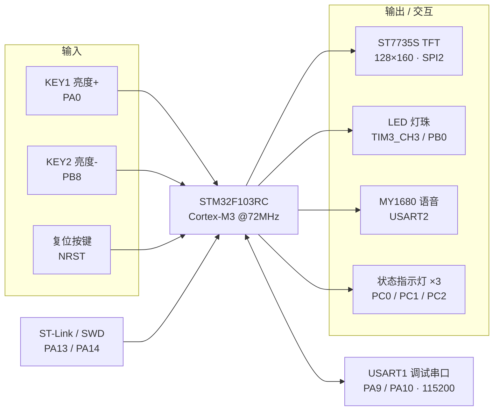

# 硬件设计说明（Hardware）

> 本文档所有引脚分配、定时器通道、通信参数均**依据固件源码逐一核对**，与 `firmware/` 中的工程保持一致。

- **主控 MCU**：STM32F103RC（ARM Cortex-M3，72 MHz，256 KB Flash / 48 KB SRAM，LQFP64）
- **固件库**：STM32F10x Standard Peripheral Library V3.5.0（编译宏 `STM32F10X_HD, USE_STDPERIPH_DRIVER`，启动文件 `startup_stm32f10x_hd.s`）
- **显示**：1.8″ TFT 彩屏，驱动 IC **ST7735S**，128×160，RGB565，硬件 SPI
- **语音**：MY1680U-12P MP3 语音模块（UART 指令 + TF 卡音频）
- **调光**：TIM3 PWM 驱动 N-MOS 管控制大功率 LED 灯珠

---

## 1. 系统框图



---

## 2. 引脚映射表（Pinout）

| 功能 | STM32 引脚 | 外设 / 模式 | 电平 / 参数 | 源码位置 |
|---|---|---|---|---|
| **PWM 调光输出** | `PB0` | TIM3_CH3，复用推挽 | 1 kHz，PWM1，高有效 | `user/api/pwm.c` |
| **KEY1 亮度加** | `PA0` | 浮空输入 | 按下为**高电平** | `user/api/key.c` |
| **KEY2 亮度减** | `PB8` | 浮空输入 | 按下为**低电平** | `user/api/key.c` |
| 状态指示灯 LED1 | `PC0` | 推挽输出 | 低电平点亮 | `user/api/led.c` |
| 状态指示灯 LED2 | `PC1` | 推挽输出 | 低电平点亮 | `user/api/led.c` |
| 状态指示灯 LED3 | `PC2` | 推挽输出 | 低电平点亮 | `user/api/led.c` |
| 调试串口 USART1_TX | `PA9` | 复用推挽 | 115200-8-N-1 | `user/api/usart.c` |
| 调试串口 USART1_RX | `PA10` | 浮空输入 | 115200-8-N-1 | `user/api/usart.c` |
| 语音 USART2_TX → MY1680_RX | `PA2` | 复用推挽 | 9600-8-N-1 | `user/api/MY1680.c` |
| 语音 USART2_RX ← MY1680_TX | `PA3` | 浮空输入 | 9600-8-N-1 | `user/api/MY1680.c` |
| 语音 BUSY 检测 | `PB11` | 浮空输入 | 播放中为高电平 | `user/api/MY1680.h` |
| TFT SPI2_SCK | `PB13` | 复用推挽 | SPI2 主机，MSB | `user/api/spi.c` |
| TFT SPI2_MISO | `PB14` | 浮空输入 | — | `user/api/spi.c` |
| TFT SPI2_MOSI | `PB15` | 复用推挽 | — | `user/api/spi.c` |
| TFT 片选 CS | `PB10` | 推挽输出 | 低有效 | `user/api/lcd.h` |
| TFT 数据/命令 DC | `PB11` | 推挽输出 | 低=命令 / 高=数据 | `user/api/lcd.h` |
| TFT 复位 RES | `PB12` | 推挽输出 | 低复位 | `user/api/lcd.h` |
| TFT 背光 BK | `PC6` | 推挽输出 | 高点亮 | `user/api/lcd.h` |
| SWD 调试 | `PA13 / PA14` | SWDIO / SWCLK | ST-Link | — |
| 系统时钟 | OSC_IN / OSC_OUT | 8 MHz HSE + PLL | 倍频至 72 MHz | `system_stm32f10x.c` |

> **引脚复用注意（PB11）**：当前固件中 `PB11` 同时被定义为 TFT 的 `DC`（`lcd.h`）与语音模块的 `BUSY`（`MY1680.h`）。二者在物理上只能接一个外设。实际接线以 TFT 的 `DC` 为准（屏幕显示为必需信号）；若需要使用语音 BUSY 忙检测，请把 BUSY 改接到任一空闲 GPIO 并同步修改 `MY1680.h` 中的 `MY1680_BUSY_*` 宏。详见文末[已知问题与改进](#5-已知问题与改进建议)。

---

## 3. PWM 调光原理

- 定时器：`TIM3`，通道 `CH3` → 引脚 `PB0`
- 时钟：定时器输入 72 MHz
- 预分频 `PSC = 72 - 1`，自动重装载 `ARR = 1000 - 1`
- PWM 频率：

  ```
  f_pwm = 72 MHz / 72 / 1000 = 1 kHz
  ```

  1 kHz 远高于人眼可感知的闪烁频率，配合视觉暂留实现**无频闪调光**。

- 比较寄存器 `CCR3` 取值 0 ~ 1000，对应占空比 0% ~ 100%
- 应用层亮度参数 `light ∈ [0,100]`，写入时 `CCR3 = light × 10`（内部做了 0~100 限幅）

| 亮度档位 light | CCR3 | 占空比 | 语音文件（TF 卡） |
|:---:|:---:|:---:|:---|
| 0（关灯） | 0 | 0% | `01/006.mp3` |
| 25 | 250 | 25% | `01/002.mp3` |
| 50 | 500 | 50% | `01/003.mp3` |
| 75 | 750 | 75% | `01/004.mp3` |
| 100（最亮） | 1000 | 100% | `01/005.mp3` |
| 开机欢迎 | — | — | `01/001.mp3` |

- PB0 输出的 PWM 信号经限流电阻驱动 **N 沟道 MOS 管（如 AO3400 / S8050 三极管）**，功率 LED 灯珠接在电源与漏极之间，通过控制导通时间比例调节平均电流，从而调节亮度。

---

## 4. 物料清单（BOM，参考）

| # | 名称 | 型号 / 规格 | 数量 | 说明 |
|---|---|---|:---:|---|
| 1 | 主控 | STM32F103RC 核心板 / 最小系统 | 1 | Cortex-M3，72 MHz |
| 2 | TFT 彩屏 | 1.8″ ST7735S，128×160，SPI | 1 | 显示界面 |
| 3 | 语音模块 | MY1680U-12P | 1 | UART 控制，TF 卡播放 |
| 4 | TF 卡 | MicroSD（≤ 32 GB，FAT32） | 1 | 存放 `01/001~006.mp3` |
| 5 | 喇叭 | 3 W / 4 Ω | 1 | 语音播报 |
| 6 | 功率 LED | 6070 暖白 3 W 灯珠 | 1 | 主照明 |
| 7 | 开关管 | N-MOS（AO3400 等） | 1 | PWM 驱动 LED |
| 8 | 轻触按键 | TS-1187A 类 | 2 | 亮度 + / 亮度 − |
| 9 | 状态指示灯 | 3 mm LED | 3 | PC0~PC2 |
| 10 | 稳压 | AMS1117-3.3 | 1 | 5 V → 3.3 V |
| 11 | 电阻 / 电容 | 10 kΩ、1 kΩ、100 nF、10 µF 等 | 若干 | 上拉 / 限流 / 去耦 |
| 12 | 下载调试 | ST-Link V2（SWD） | 1 | 烧录与调试 |
| 13 | 供电 | USB / Type-C 5 V | 1 | 系统供电 |

> TFT 与主控的接线：`SCK→PB13、MISO→PB14、MOSI→PB15、CS→PB10、DC→PB11、RES→PB12、BLK→PC6、VCC→3.3V、GND→GND`。

---

## 5. 已知问题与改进建议

- **PB11 复用冲突**：TFT 的 DC 与语音 BUSY 当前都映射到 PB11，二选一使用；建议给 BUSY 单独分配空闲引脚。
- **五档步进调光**：当前为 0/25/50/75/100 五档，后续可改为无级连续调光。
- **可增加环境光传感器**（如 BH1750，I²C）实现自适应亮度，或用 ADC + 电位器/旋钮调光。
- **可增加无线模块**（蓝牙 / Wi-Fi）与手机 App，配合已预留的 USART1 指令协议实现远程控制。
- **可加入护眼策略**：定时休息提醒、模拟日出渐亮唤醒、长时间使用告警等。
